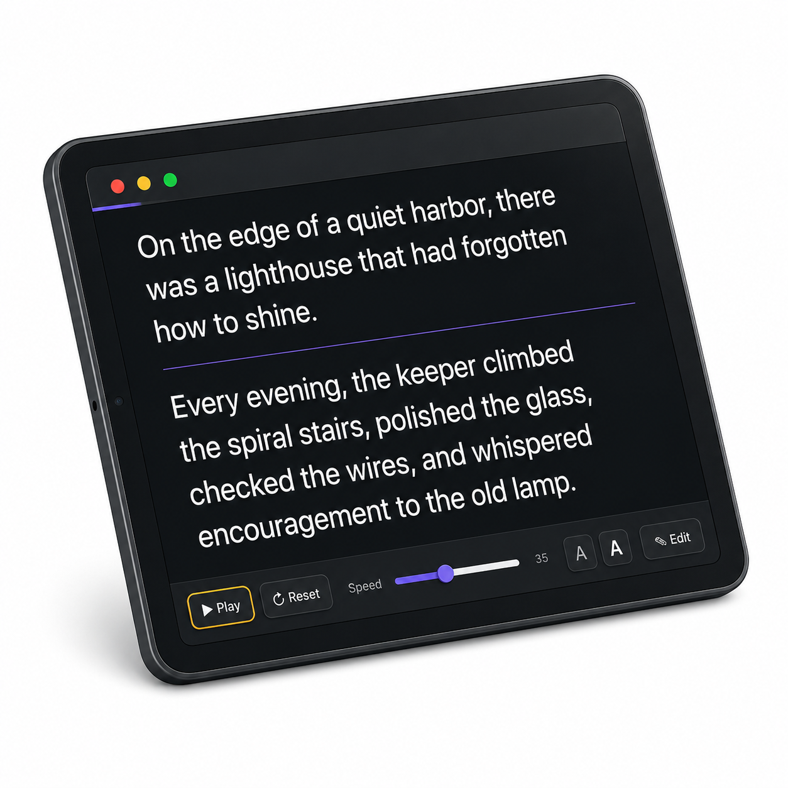

  

# Teleprompter

A simple browser-based teleprompter built as a single HTML file. It includes playback controls, adjustable scroll speed, font-size controls, keyboard shortcuts, and an inline script editor.

## Features

- Play/pause automatic scrolling
- Adjustable scroll speed
- Adjustable font size
- Progress indicator
- Editable script panel
- Keyboard shortcuts for common controls
- Custom brand color palette

## Keyboard Shortcuts

- `Space`: Play or pause
- `R`: Reset
- `+` / `-`: Increase or decrease font size
- `E`: Open or close editor

## Use

Open `index.html` in a browser, or publish this repo with GitHub Pages.
